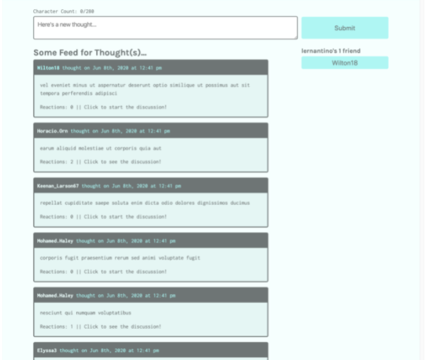

# deep-thoughts
Module 21: MERN

## Purpose
Combine all four technologies of the MERN stack (MongoDB, Express.js, React, and Node.js) to build a social media application called Deep Thoughts. 
Users will be able to sign up and create an account, post their thoughts, and interact with other users, just like you might find in the social media apps you use day in and day out in real life.

## Built With
* GraphQL
* Apollo Server
* Reacr Router
* concurrently npm package
* JSON web tokens
* jwt-decode
* faker
* nodemon
* Git Hub

## Contribution
Made with ❤️ by Samantha Malone
Shout out to my tutor
© 2021 Samantha Malone. All rights reserved.
